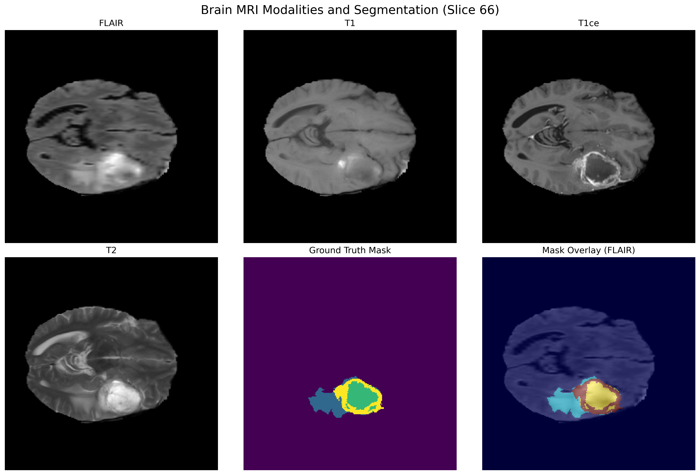
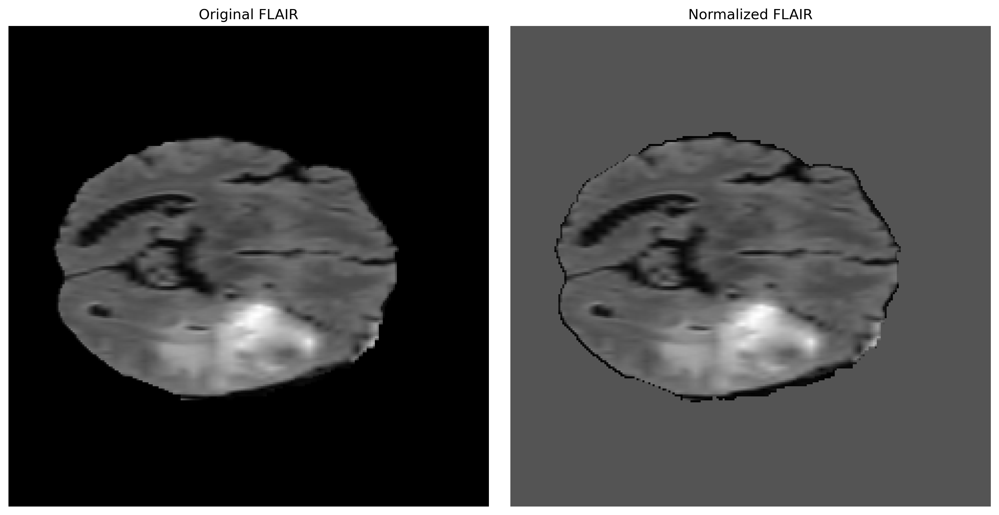
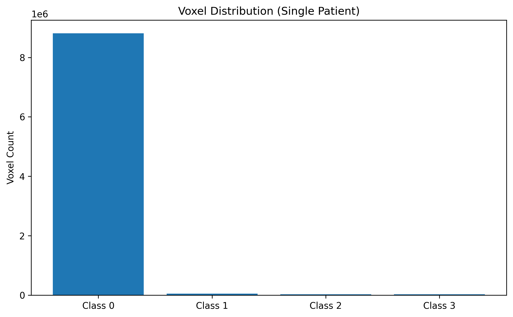
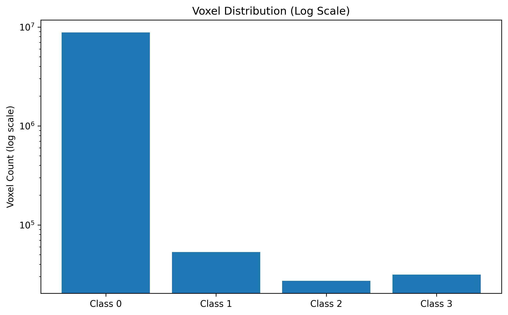
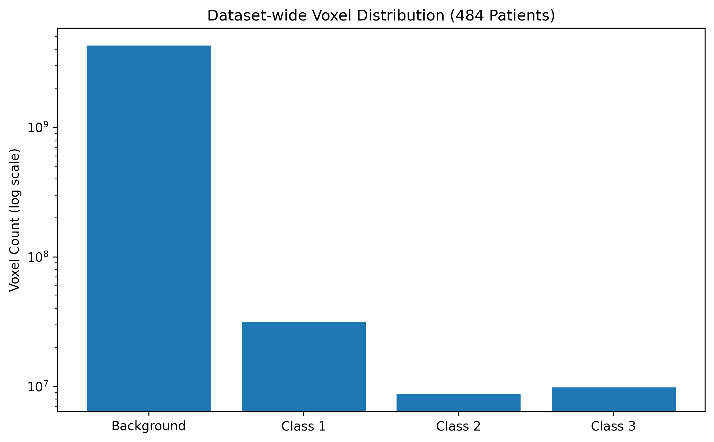

# neuroBrain
# Brain Tumor MRI Segmentation

A research-oriented deep learning project for brain tumor segmentation using the Medical Segmentation Decathlon (MSD) dataset.

## Objectives

- Explore and analyze 3D brain MRI data
- Build an efficient segmentation pipeline
- Train and evaluate a deep learning model
- Compare lightweight approaches suitable for limited computational resources

## Dataset

Medical Segmentation Decathlon - Brain Tumour Dataset </br>
http://medicaldecathlon.com/dataaws/ </br>
https://msd-for-monai.s3-us-west-2.amazonaws.com/Task01_BrainTumour.tar

## Dataset Overview

The dataset contains multimodal MRI scans with expert-annotated tumor segmentation masks.

The first exploratory visualization compares the four MRI modalities together with the corresponding segmentation mask.



---

## Getting Started

### 1. Clone the repository

```bash
git clone https://github.com/ethicalcod/neuroBrain.git
cd neuroBrain
```

### 2. Open Google Colab

Upload or open any project notebook from the `notebooks/` directory.

### 3. Run the automated project setup

```bash
python scripts/setup_project.py
```

The setup script automatically:

- Installs required Python packages
- Installs the `tree` utility (if needed)
- Downloads the Medical Segmentation Decathlon (Task01 Brain Tumour) dataset (only if it is not already available)
- Extracts the dataset
- Verifies the project structure
- Displays the project directory tree

Once the setup completes successfully, the project is ready for preprocessing, model development, and training.

---

### Project Structure

```
neuroBrain/
├── docs/
├── figures/
├── models/
├── notebooks/
├── results/
├── scripts/
│   ├── setup_dataset.py
│   ├── setup_project.py
│   └── verify_project.py
├── src/
│   ├── config.py
│   └── preprocessing.py
└── Task01_BrainTumour/
```
## Development Workflow

For every new Google Colab session:

1. Clone the repository.
2. Navigate to the project directory.
3. Run:

```bash
python scripts/setup_project.py
```

After the setup completes successfully, continue working with the notebooks inside the `notebooks/` directory.

## MRI Preprocessing

Before training a deep learning model, MRI intensity distributions were analyzed to determine an appropriate preprocessing strategy.

### Research Questions

- Are MRI intensities standardized across modalities?
- How much of each MRI volume consists of background voxels?
- What normalization strategy is appropriate for this dataset?

### Key Findings

- MRI modalities exhibit different intensity distributions.
- Histograms reveal a dominant spike at zero intensity due to background voxels.
- Including background voxels biases intensity statistics.
- Therefore, Z-score normalization is performed using only non-zero voxels.

### Implementation

A reusable preprocessing module was implemented in:

src/preprocessing.py

which performs non-zero voxel normalization for each MRI modality.

### Normalization Example




## Dataset Analysis

### MRI Modalities


---

### Intensity Normalization


---

### Single Patient Class Distribution



---

### Log Scale Distribution



---

### Dataset-wide Class Distribution




## Status

## Project Progress

### Milestone 1 — Dataset Exploration & Preprocessing

- [x] Repository setup
- [x] Dataset download and inspection
- [x] MRI modality visualization
- [x] Intensity distribution analysis
- [x] Non-zero voxel normalization
- [x] Single-patient tumor class distribution
- [x] Dataset-wide class imbalance analysis
- [x] Reusable preprocessing module
- [x] Centralized project configuration

### Upcoming

- [ ] PyTorch Dataset
- [ ] MONAI transforms
- [ ] 3D U-Net implementation
- [ ] Model training
- [ ] Evaluation
- [ ] Inference

