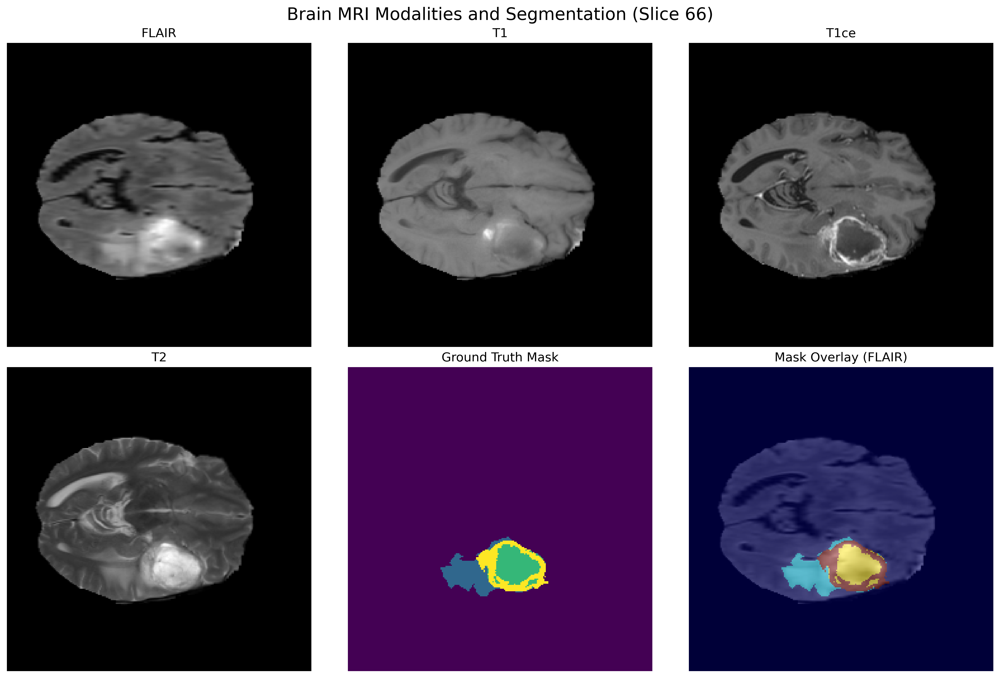
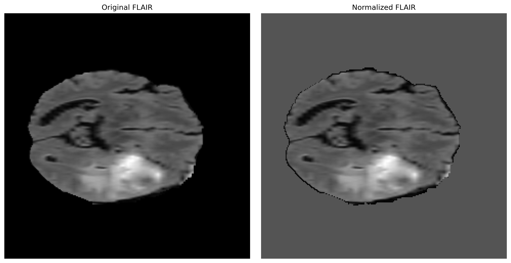
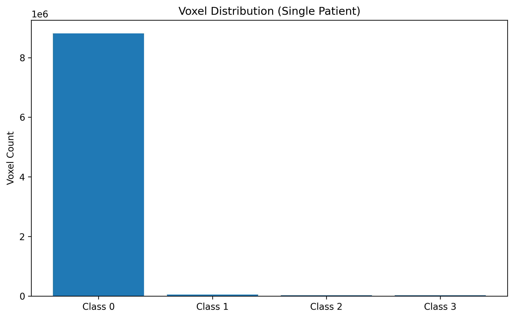
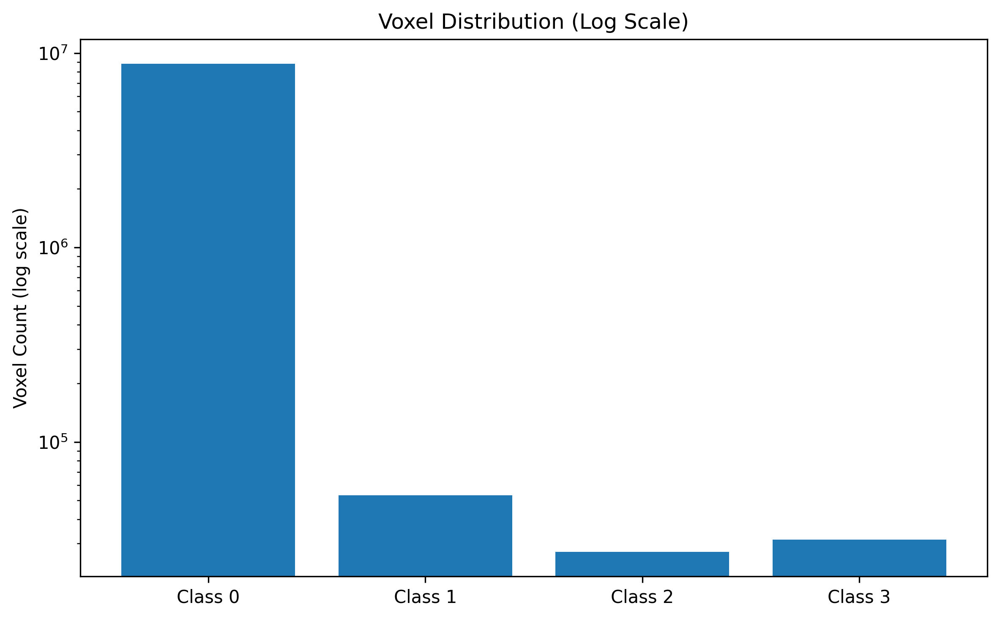
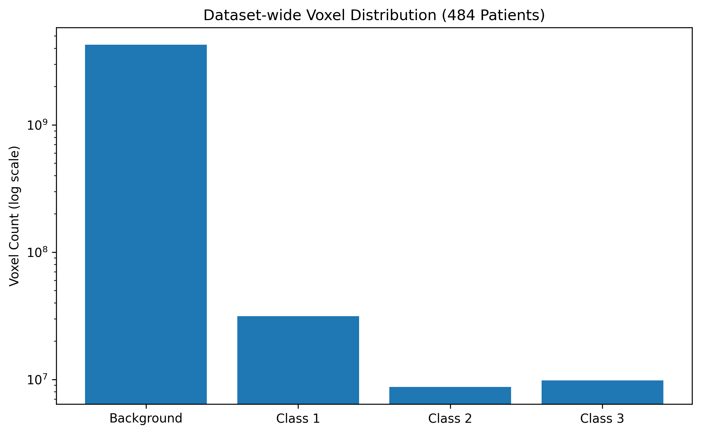

# neuroBrain — 3D Brain Tumor MRI Segmentation

neuroBrain is a research-oriented deep learning project for **3D brain tumor segmentation from multi-modal MRI volumes** using PyTorch and MONAI.

The project focuses on reproducible 3D medical-image segmentation under limited computational resources.

---

## Objective

The model performs four-class voxel-wise segmentation of brain tumor MRI volumes.

### MRI modalities

- FLAIR
- T1
- T1ce
- T2

### Segmentation labels

| Label | Region |
|---:|---|
| 0 | Background |
| 1 | Edema |
| 2 | Non-enhancing tumor |
| 3 | Enhancing tumor |

### Composite regions

- **Whole Tumor (WT)** = labels 1 + 2 + 3
- **Tumor Core (TC)** = labels 2 + 3
- **Enhancing Tumor (ET)** = label 3

---

## Dataset

Medical Segmentation Decathlon - Brain Tumour Dataset </br>
http://medicaldecathlon.com/dataaws/ </br>
https://msd-for-monai.s3-us-west-2.amazonaws.com/Task01_BrainTumour.tar

## Dataset Overview

The dataset contains multimodal MRI scans with expert-annotated tumor segmentation masks.

The first exploratory visualization compares the four MRI modalities together with the corresponding segmentation mask.



---

## Getting Started

### 1. Open Google Colab

Upload or open any project notebook from the `notebooks/` directory.

### 2. Clone the repository

```bash
git clone https://github.com/ethicalcod/neuroBrain.git
cd neuroBrain
```

### 3. Run the automated project setup

```bash
python scripts/setup_project.py
```

The setup script automatically:

- Installs required Python packages
- Installs the `tree` utility (if needed)
- Downloads the Medical Segmentation Decathlon (Task01 Brain Tumour) dataset (only if it is not already available)
- Extracts the dataset
- Verifies the project structure
- Displays the project directory tree

Once the setup completes successfully, the project is ready for preprocessing, model development, and training.

---

## Development Workflow

For every new Google Colab session:

1. Clone the repository.
2. Navigate to the project directory.
3. Run:

```bash
python scripts/setup_project.py
```

After the setup completes successfully, continue working with the notebooks inside the `notebooks/` directory.

## MRI Preprocessing

Before training a deep learning model, MRI intensity distributions were analyzed to determine an appropriate preprocessing strategy.

### Research Questions

- Are MRI intensities standardized across modalities?
- How much of each MRI volume consists of background voxels?
- What normalization strategy is appropriate for this dataset?

### Key Findings

- MRI modalities exhibit different intensity distributions.
- Histograms reveal a dominant spike at zero intensity due to background voxels.
- Including background voxels biases intensity statistics.
- Therefore, Z-score normalization is performed using only non-zero voxels.

### Implementation

A reusable preprocessing module was implemented in:

src/preprocessing.py

which performs non-zero voxel normalization for each MRI modality.

### Normalization Example




## Dataset Analysis

### MRI Modalities


---

### Intensity Normalization


---

### Single Patient Class Distribution



---

### Log Scale Distribution



---

### Dataset-wide Class Distribution




## Dataset Brief

Medical Segmentation Decathlon — Task01 BrainTumour.

The project uses:

- 484 valid patients
- 387 training patients
- 97 validation patients
- deterministic random seed: 42

Hidden macOS `._*` files are excluded from patient counting.

The dataset itself is not stored in GitHub.

---

## Preprocessing

Each MRI modality is normalized using only non-zero voxels.

For non-zero voxels:

x' = (x - mean) / standard deviation

This prevents the large zero-background region from dominating the intensity statistics.

---

## Model

The model is a 3D U-Net implemented with MONAI.

| Parameter | Value |
|---|---:|
| Spatial dimensions | 3D |
| Input channels | 4 |
| Output classes | 4 |
| Feature channels | 16, 32, 64, 128, 256 |
| Residual units | 2 |
| Dropout | 0.2 |
| Parameters | 4,811,129 |

---

## Training

Training configuration:

| Parameter | Value |
|---|---:|
| Epochs | 20 |
| Batch size | 2 |
| Patch size | 96 × 96 × 96 |
| Optimizer | AdamW |
| Learning rate | 1e-4 |
| Weight decay | 1e-5 |
| Loss | Hybrid Dice + Cross-Entropy |
| Scheduler | ReduceLROnPlateau |
| Random seed | 42 |

Training was performed using GPU notebook environments.

Persistent checkpoints were maintained externally so training could be resumed after notebook interruptions.

---

## Checkpoint

The selected checkpoint is:

**Epoch 18**

Stored checkpoint metric:

**0.7628627273**

The latest Epoch-20 checkpoint is also preserved separately.

Model checkpoints and training history are maintained in the project's Hugging Face checkpoint repository rather than GitHub.

---

# Final 97-Patient Validation

All **97 validation patients** were evaluated.

Inference configuration:

- Checkpoint: Epoch 18
- ROI: 96 × 96 × 96
- Sliding-window batch size: 1
- Overlap: 0.25

## Final Results

| Metric | Mean Dice | Std | Min | Max |
|---|---:|---:|---:|---:|
| Background | 0.9988 | 0.0007 | 0.9964 | 0.9998 |
| Edema | 0.7061 | 0.1401 | 0.2466 | 0.9096 |
| Non-enhancing tumor | 0.4738 | 0.2450 | 0.0000 | 0.9537 |
| Enhancing tumor | 0.7106 | 0.2375 | 0.0000 | 0.9348 |
| Whole Tumor (WT) | 0.8450 | 0.1106 | 0.3540 | 0.9679 |
| Tumor Core (TC) | 0.7352 | 0.2028 | 0.0769 | 0.9690 |
| Enhancing Tumor (ET) | 0.7106 | 0.2375 | 0.0000 | 0.9348 |
| Mean Tumor Dice | 0.6302 | 0.1436 | 0.1426 | 0.8690 |


### Metric interpretation

**Mean Tumor Dice = 0.6302 in the completed evaluation structure** is defined as the arithmetic mean of individual tumor labels 1, 2, and 3.

The checkpoint-selection metric is different because it is based on WT/TC/ET. The stored Epoch-18 checkpoint metric is therefore reported separately.

The final validation results are patient-level averages across 97 validation patients.

---

## Key observation

Whole-tumor segmentation achieved substantially stronger overlap than the more fine-grained tumor-subregion segmentation.

The non-enhancing tumor class was the most challenging individual tumor class in this experiment.

This result motivates future investigation of class imbalance, region-aware losses, architecture changes, and targeted ablation studies.

---

## Figures

The repository contains:

- `01_modalities_overview.png`
- `02_normalization_comparison.png`
- `03_single_patient_class_distribution.png`
- `04_single_patient_class_distribution_log.png`
- `05_dataset_class_distribution.png`
- `06_final_validation_dice.png`
- `07_tumor_region_dice.png`
- `08_patient_dice_distribution.png`
- `09_training_validation_loss.png`
- `10_qualitative_segmentation_examples.png`

---

## Results

Final evaluation artifacts are stored in:

`results/final_evaluation/`

including:

- `patient_metrics.json`
- `final_metrics.json`
- `evaluation_progress.json`
- `evaluation_summary.txt`
- `final_metrics_table.csv`

A detailed evaluation report is available at:

`docs/final_evaluation.md`

---

## Reproducibility

The validation split uses random seed 42 and contains 387 training and 97 validation patients.

The complete preprocessing, model, evaluation, and project configuration is contained in the repository.

The trained model checkpoint and training history are maintained separately on Hugging Face.

---

## Limitations

This project is a research and educational segmentation experiment and is not a clinically validated diagnostic system.

Limitations include:

- fixed internal validation split;
- limited dataset size;
- limited training duration;
- class-dependent segmentation performance;
- no external clinical validation;
- no clinical deployment validation;
- no claim of diagnostic performance.

---

## Future Work

Potential future experiments include:

1. Cross-validation.
2. Longer training.
3. Class-balanced losses.
4. Region-aware losses.
5. SegResNet comparison.
6. Ablation studies.
7. External validation.
8. Uncertainty estimation.
9. Robustness analysis.
10. Failure-case analysis.
11. Statistical confidence intervals.
12. Model calibration.

---

## Project Structure

```text
neuroBrain/
├── docs/
├── figures/
├── models/
├── notebooks/
├── results/
│   └── final_evaluation/
├── scripts/
├── src/
├── .gitignore
├── LICENSE
├── README.md
└── requirements.txt  
